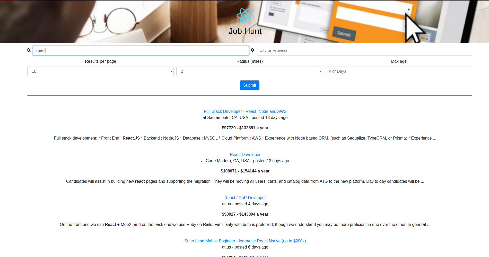

# Job.Hunt

A simple react application designed to help job seek's hunt their jobs. This app is built off ZipRecruiter's job search API and is built as a Minimum Viable Product.

This site is currently hosted on [Netlify](https://unruffled-hugle-58dcdd.netlify.com/)
## Final Product

### Prerequisites
Your own api key from Zip Recruiter

### Getting started

1.  Install dependencies: `npm i`
2.  Create your own `.env` using the `.envexample` provided.(Zip Recruiter key here)
3.  run 'npm start'
4.  Visit [localhost:3000](http://localhost:3000/)

### Testing

Tests are written with Cypress. To run them, use `npm run cypress`.